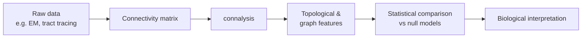

# Connectome Analysis

[`connalysis`](https://github.com/openbraininstitute/connectome-analysis) is a Python library for analysing connectomes from a **topological** perspective — simplex counts, directed flag complexes, communicability, and more — on top of standard graph-theoretic measures.

!!! info "Upstream project"
    This section is a learning-oriented companion to the official documentation. For the authoritative API reference, see the [upstream docs](https://openbraininstitute.github.io/connectome-analysis/).

## What the library is good for

- Loading sparse connectivity matrices (synaptic or region-level) into Python.
- Computing **topological invariants**: simplex counts, Betti numbers, neighbourhood profiles.
- Computing classical graph metrics with sensible defaults for large, sparse, directed networks.
- Producing **null models** (Erdős–Rényi, distance-dependent, degree-preserving) to test which structural features are biologically meaningful.

## What it is *not*

- Not a simulator — it does not run neural dynamics.
- Not a viewer — it produces numbers and arrays, not 3D renderings.
- Not a general-purpose graph library — for that, use `networkx`, `graph-tool`, or `igraph`.

## Sections in this guide

| Page | What it covers |
|---|---|
| [Installation](installation.md) | Setting up a working environment with `pip` / `uv`. |
| [Quickstart](quickstart.md) | Load a matrix and compute your first analysis in under 10 lines. |
| [Concepts](concepts.md) | What a *simplex*, *flag complex*, and *null model* actually mean. |
| [Examples](examples.md) | Worked examples on small toy networks. |
| [Upstream docs](upstream.md) | Pointer page to the official reference. |
| [API Reference](../api/index.md) | Auto-generated function-level reference for every module. |

## Where this fits in the wider workflow

This site focuses on the **C → D → E** steps.
